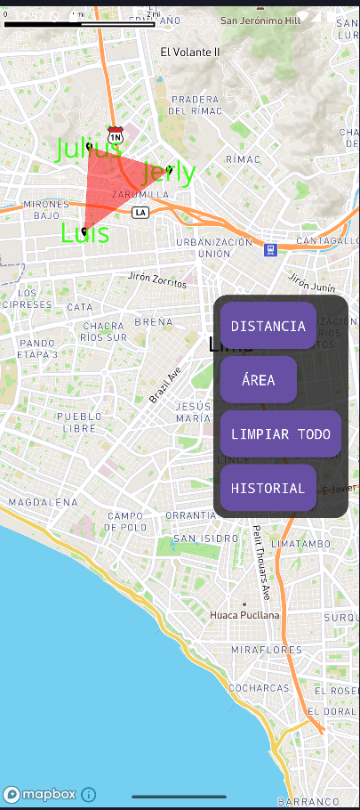
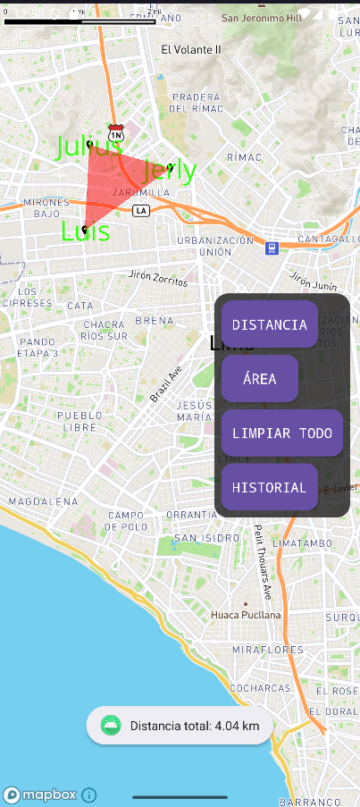

# 📍 T3 Examen - App de Mapas Interactivos con Kotlin y Mapbox

Aplicación Android desarrollada en Kotlin que integra Mapbox para ofrecer una experiencia de mapas interactivos con marcadores personalizados, cálculo de distancias, áreas, y almacenamiento persistente usando Room. Este proyecto fue desarrollado como parte del curso de Desarrollo de Aplicaciones Móviles - Semana 13.

---

## ✨ Funcionalidades Principales

- 🗺️ Mapa interactivo con zoom, desplazamiento y rotación.
- 📍 Agregado de marcadores personalizados con nombre, fecha y nota.
- 📏 Cálculo de distancia total entre los marcadores (medido en metros y kilómetros).
- 🔺 Cálculo del área delimitada por 3 o más marcadores (usando polígono).
- 💾 Guardado local de marcadores en base de datos Room.
- 🕓 Historial de ubicaciones registradas.
- 🧽 Botón para mover los marcadores actuales al historial y limpiar el mapa.
- 🖼️ Diseño visual estilo *Cyberpunk*.

---

## 📱 Capturas de Pantalla

| Mapa con marcadores | Distancia entre puntos | Área delimitada |
|---------------------|------------------------|------------------|
|  |  |  |

> 📁 Las capturas deben ir en una carpeta `screenshots/` dentro del repositorio.

---

## 🛠️ Tecnologías Usadas

- **Kotlin** - Lenguaje principal.
- **Mapbox v10+** - Motor de mapas.
- **Room** - Base de datos local persistente.
- **Coroutines** - Para operaciones asincrónicas.
- **ViewBinding** - Para manejo de vistas.
- **Material Design** - Para los componentes visuales.

---

## ⚙️ Requisitos del Proyecto

- Android Studio Electric Eel o superior.
- Android SDK 24+
- Conexión a internet para cargar mapas.
- Token de acceso de Mapbox (añadir en `res/values/strings.xml`):

