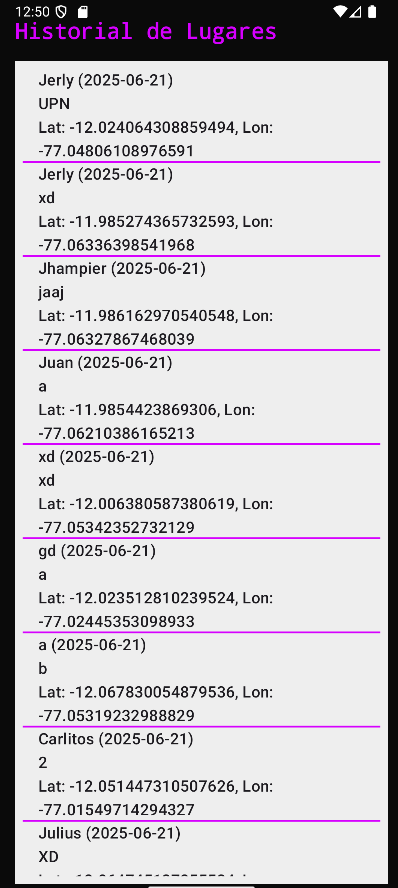

# 📍 T3 Examen – Aplicación de Mapas Interactivos con Kotlin y Mapbox

Aplicación Android desarrollada en **Kotlin** que utiliza **Mapbox** para ofrecer una experiencia de mapas interactivos con marcadores personalizados, cálculo de distancias y áreas, además de almacenamiento local mediante **Room**. Este proyecto fue elaborado como parte del curso de **Desarrollo de Aplicaciones Móviles – Semana 13**.

---

## ✨ Funcionalidades Principales

- 🗺️ **Mapa Interactivo**  
  Soporte para zoom, desplazamiento y rotación en tiempo real.

- 📍 **Marcadores Personalizados**  
  Permite agregar marcadores con nombre, fecha y notas descriptivas.

- 📏 **Cálculo de Distancias**  
  Calcula la distancia total entre los puntos seleccionados, mostrando el resultado en metros y kilómetros.

- 🔺 **Cálculo de Áreas**  
  Permite delimitar un área usando 3 o más puntos, mostrando el área en m² o km² utilizando polígonos.

- 💾 **Almacenamiento Local**  
  Guarda los marcadores de forma persistente usando Room.

- 🕓 **Historial de Ubicaciones**  
  Lista de marcadores registrados previamente, con opción para consultar y reutilizar.

- 🧽 **Limpieza y Respaldo**  
  Funcionalidad para mover los marcadores actuales al historial y limpiar el mapa.

- 🖼️ **Diseño Cyberpunk**  
  Interfaz visual moderna inspirada en el estilo *Cyberpunk* con colores vibrantes y oscuros.

---

## 📸 Capturas de Pantalla

| Mapa | History | Distancia |
|---------------------|---------------------|------------------|
|  |  |  |

---

## 🛠️ Tecnologías y Herramientas

- **Kotlin** – Lenguaje de desarrollo principal.
- **Mapbox SDK v10+** – Visualización de mapas y gestión de ubicaciones.
- **Room (Jetpack)** – Persistencia local de datos.
- **Coroutines** – Manejo eficiente de tareas asincrónicas.
- **ViewBinding** – Acceso seguro a vistas XML sin `findViewById`.
- **Material Design** – Componentes visuales modernos y accesibles.

---

## ⚙️ Requisitos para Ejecutar el Proyecto

- Android Studio **Electric Eel** o superior.
- Android SDK **24 o superior**.
- Conexión a internet para la carga de mapas.
- **Token de acceso de Mapbox**  
  Agrega tu token personal en el archivo `res/values/strings.xml`:
  
## 👨‍💻 Desarrollado por
Himer Jerly Cóndor Luna
📧 himer.condor@gmail.com
